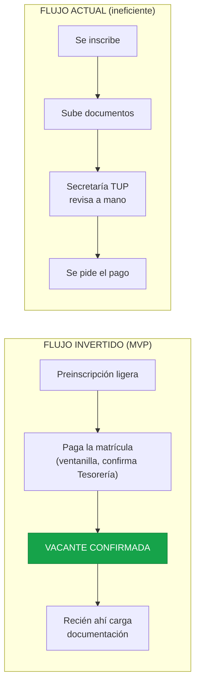

# TFI — Sistema de Ingreso TUP (UTN FRH)

Trabajo Final Integrador del Equipo 5. Digitaliza el proceso de ingreso a la **Tecnicatura
Universitaria en Programación** de la UTN Facultad Regional Haedo.

## El problema y la idea

Hoy el ingreso se sostiene con una cadena de herramientas desconectadas (formulario, Drive, Excel,
mail) y Secretaría revisa documentación a mano **antes** de saber si el aspirante va a pagar: se
gasta tiempo en gente que nunca paga.

La propuesta invierte el flujo. Regla central, definida por el Director:

> **Pago acreditado = vacante confirmada.** La documentación se revisa recién después.



Todos los diagramas de la solución (arquitectura hexagonal, paquetes, estados de la Postulación,
integración con la facultad y secuencias de pago) están en [docs/architecture](docs/architecture/).

## Estado

🚧 **Fin del descubrimiento, arranque de la construcción.** La etapa de entrevistas terminó;
quedan detalles por ajustar con la facultad. Están definidos la constitución, la arquitectura y el
stack. Todavía no hay código de producción.

## Por dónde empezar

| Si querés... | Leé |
|---|---|
| Conocer las reglas del proyecto | [Constitución](.specify/memory/constitution.md) |
| Escribir código | [Guía de estructura del código](docs/architecture/estructura-codigo.md) |
| Ver la arquitectura en diagramas | [Visión general](docs/architecture/overview.md) y [secuencia de pago](docs/architecture/secuencia-pago.md) |
| Entender por qué se decidió algo | [Decisiones (ADRs)](docs/decisions/) |
| Ver entrevistas e ideación | [Discovery](docs/discovery/) |
| Recorrer toda la documentación | [Índice de docs](docs/README.md) |
| Aportar al repositorio | [CONTRIBUTING.md](CONTRIBUTING.md) |
| Configurar tu agente de código | [AGENTS.md](AGENTS.md) |

## Arquitectura y stack

- **Arquitectura hexagonal** ([ADR-0001](docs/decisions/0001-usar-arquitectura-hexagonal.md)): el
  negocio vive aislado en el centro y todo lo de afuera (UI, base de datos, pagos) se conecta por
  puertos y adaptadores intercambiables.
- **Monorepo pnpm**: `packages/domain`, `packages/application`, `packages/infrastructure` y
  `apps/web`. Las dependencias apuntan siempre hacia `domain`.
- **Stack**: TypeScript estricto, Next.js, Supabase (PostgreSQL, Auth, Storage), Zod, Vitest,
  Tailwind CSS + shadcn/ui.
- **Pensado para crecer** a otras instituciones
  ([ADR-0002](docs/decisions/0002-disenar-para-multi-institucion.md)), sin construir
  multi-tenancy hasta que haga falta.

## Estructura del repositorio

```
TFI/
├── .specify/memory/
│   └── constitution.md               reglas del proyecto (fuente de verdad)
├── docs/
│   ├── README.md                     índice maestro de la documentación
│   ├── DOCUMENTO-SEGUIMIENTO-PROYECTO.md   entregable de la cátedra (se compila en PDF)
│   ├── architecture/                 visión técnica
│   │   ├── overview.md               diagramas: hexagonal, paquetes, estados, integración
│   │   ├── secuencia-pago.md         secuencias de pago y acreditación
│   │   └── estructura-codigo.md      guía práctica para escribir código
│   ├── decisions/                    ADRs (decisiones de arquitectura con su contexto)
│   ├── discovery/                    descubrimiento con Design Thinking
│   │   ├── entrevistas/              entrevistas (Director, Secretaría, Sistemas y Administración)
│   │   │   └── guias/                guías para preparar entrevistas
│   │   └── ideacion/                 ideas evaluadas y su ranking
│   │       └── ideas/                una ficha por idea
│   ├── product/                      historias de usuario y gestión del backlog
│   └── _referencias/                 material de apoyo ajeno (ejemplo SADA, transcripciones)
├── src/
│   └── test_frontend/                maquetas HTML de las pantallas del postulante
├── AGENTS.md                         instrucciones para agentes de código
├── CONTRIBUTING.md                   cómo aportar: ramas, PR y revisiones
├── README.md
└── .gitignore
```

> El código de la solución todavía no existe. Cuando arranque, irá en `apps/` y `packages/` en la
> raíz (ver la [guía de estructura del código](docs/architecture/estructura-codigo.md)).

## Cómo trabajamos

El detalle está en [CONTRIBUTING.md](CONTRIBUTING.md). En resumen:

- **Ramas**: `main` (entrega), `develop` (integración) y ramas `feature/*`, `fix/*`, `test/*`
  creadas desde `develop`. Nadie commitea directo a `main` ni a `develop`.
- **Pull Requests** chicos hacia `develop`, con merge Squash y la revisión de al menos un
  compañero. Los cambios en `packages/domain` o en los puertos necesitan dos aprobaciones.
- **Calidad**: un PR no se mergea si fallan `tsc --noEmit`, ESLint o Vitest.
- **Tablero de tareas**: GitHub Projects.
