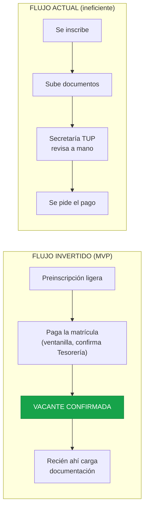
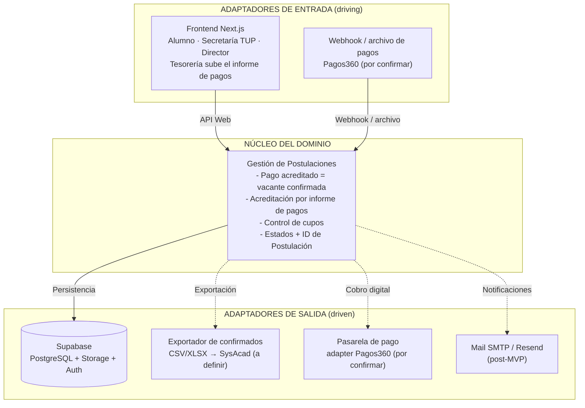
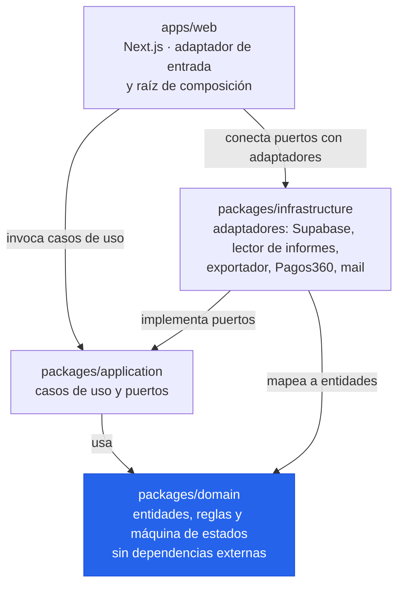
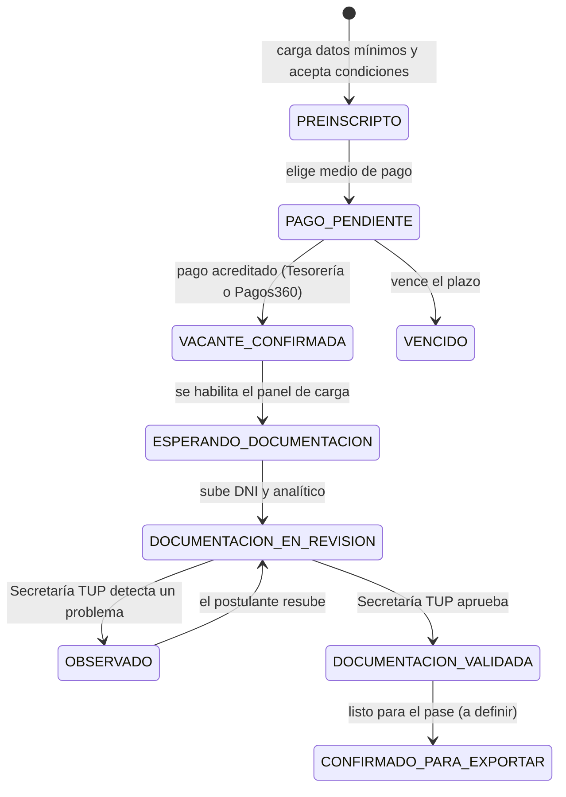
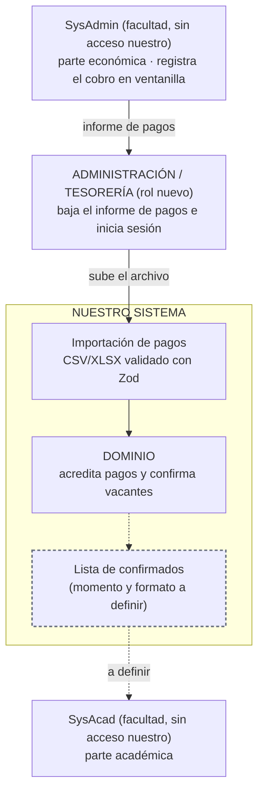

# Arquitectura — Visión general (MVP)

Vista consolidada de la solución inicial. Las decisiones que la originan están en
[ADR-0001](../decisions/0001-usar-arquitectura-hexagonal.md) y
[ADR-0002](../decisions/0002-disenar-para-multi-institucion.md); las reglas que la gobiernan, en la
constitución del proyecto (`.specify/memory/constitution.md`).

> **Estado:** borrador inicial. Los elementos con trazo punteado o marcados *(por confirmar)* /
> *(a definir)* dependen de conversaciones pendientes con la facultad (ver
> [Pendientes](#pendientes-por-definir)).

## 1. Flujo invertido: pago acreditado = vacante confirmada

Regla central del negocio, definida por el Director: el pago filtra y confirma la vacante; la
documentación se revisa recién después.

## 2. Arquitectura hexagonal

Núcleo de dominio puro (sin frameworks ni base de datos) más puertos y adaptadores. Los trazos
punteados son lo que todavía no está confirmado o es post-MVP.

En el código, el núcleo se divide en `packages/domain` (entidades, reglas, máquina de estados) y
`packages/application` (casos de uso y puertos), según la constitución (Principio I). Los casos de
uso son **preliminares**: se afinan al especificar cada feature.

## 3. Paquetes del monorepo y dependencias

Cómo se parte el hexágono en código (constitución, Principio I). La flecha significa "depende de":
todo termina en `domain`, que no depende de nadie. Un paquete no puede importar lo que no declara
en su `package.json`, y una regla de lint de límites entre capas falla en CI.

`application` define los puertos (interfaces) e `infrastructure` los implementa; `apps/web` los
conecta al arrancar. Por eso se puede cambiar Supabase o Pagos360 sin tocar el dominio.

## 4. Ciclo de vida de la Postulación

Máquina de estados modelada en `domain`. Las transiciones inválidas deben ser imposibles o ser
rechazadas (constitución, Principio II).

> El estado final y su nombre dependen de cómo se defina la entrega de la lista de confirmados
> (ver pendientes). `CONFIRMADO_PARA_EXPORTAR` es un nombre provisorio.

## 5. Integración con la facultad: solo por archivo

El sistema **no lee ni escribe** las bases de SysAdmin ni SysAcad (constitución, Principio V).
El archivo viaja con una persona: Tesorería baja el informe de pagos de SysAdmin y lo sube a
nuestro sistema con su login y su rol. La entrega de la lista de confirmados a SysAcad todavía no
está definida.

## Pendientes por definir

- **Cuándo y cómo se exporta la lista de confirmados** al sistema académico: falta hablar con el
  Director y con el encargado de Sistemas.
- **Pagos360**: el convenio y la interfaz no están confirmados. Se contempla detrás del puerto
  `PasarelaDePago` para poder cambiarlo sin tocar el dominio, pero el esfuerzo del MVP se centra
  en la comunicación con Tesorería.
- **Formato del informe de pagos de SysAdmin** que sube Tesorería: columnas, códigos y con qué dato
  se cruza cada fila con una Postulación. Falta pedírselo a Administración.
- **Alojamiento** (Vercel + Supabase): no fue consultado con Sistemas; ver constitución, sección
  Stack y restricciones técnicas.

Fuera del MVP (constitución, Principio VI): OCR de analíticos, LLM para feedback, conciliación de
transferencias con OCR, agente Go contra SQL Server, mails automáticos al pagador.
