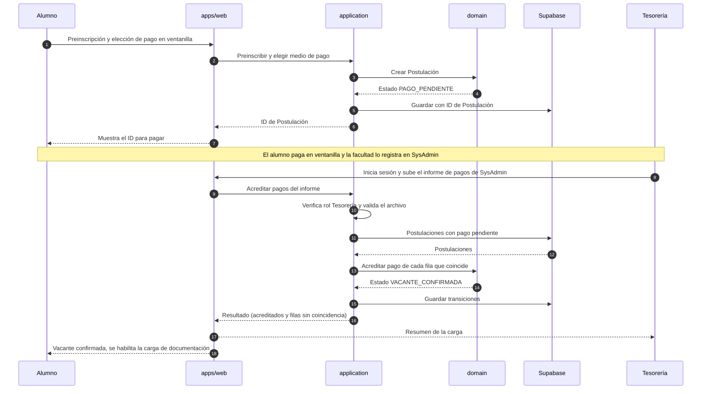
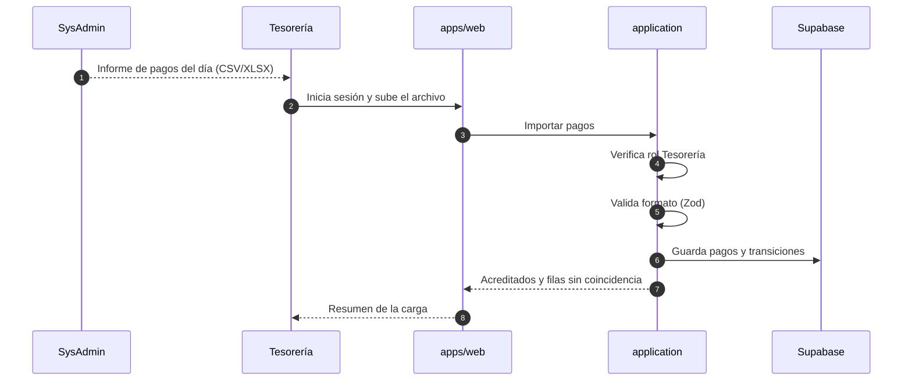
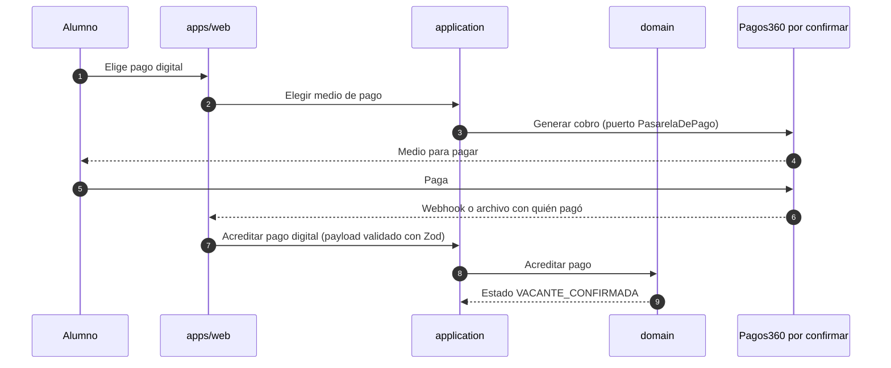

# Secuencia — Pago y confirmación de vacante

Cómo una Postulación llega a `VACANTE_CONFIRMADA`. El camino principal del MVP es el **pago en
ventanilla, cuyo informe sube Administración/Tesorería**; el pago digital por Pagos360 se contempla
pero **no está confirmado**.

Vista general en [overview.md](./overview.md).

## Camino principal: ventanilla, informe de SysAdmin y carga por Tesorería

> Cómo se cruza cada fila del informe con una Postulación (ID, DNI u otro dato) y qué columnas trae
> el informe **no está definido**: es información que falta pedirle a Administración.

## Cierre del día: carga del informe de pagos

Una carga por día, al final del día, acordada con Administración. Tesorería baja el informe de
SysAdmin con las interfaces de ese sistema y lo sube al nuestro con su login y su rol; el sistema
no toca la base de SysAdmin. Es el mismo paso del camino principal, visto desde el archivo.

## Alternativa por confirmar: pago digital con Pagos360

Depende de que se confirme el convenio y la interfaz. Va detrás del puerto `PasarelaDePago`, de
modo que cambiar o quitar la pasarela sea cambiar un adaptador, sin tocar el dominio.

> El payload del webhook o del archivo se valida en runtime con Zod en el borde (constitución,
> Principio IV).
